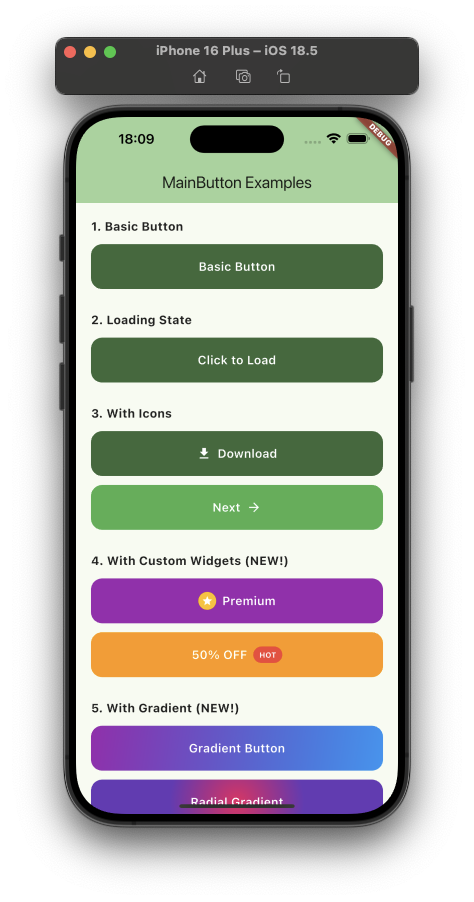
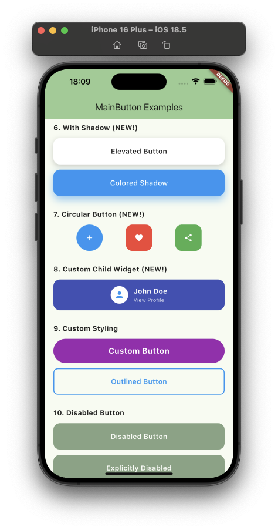
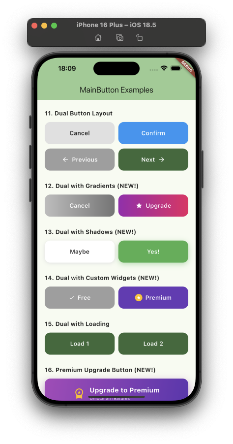
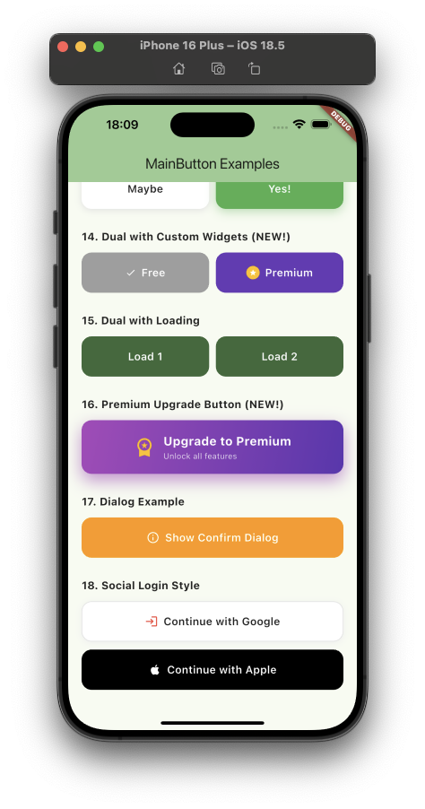

# flutter_main_button

A versatile and customizable Flutter button widget that supports both single and dual-button layouts with built-in loading states, icons, gradients, shadows, and extensive styling options.

## Features

✨ **Single & Dual Layouts**: Use as a single button or display two buttons side-by-side  
🔄 **Loading States**: Built-in loading spinner with automatic state handling  
🎨 **Fully Customizable**: Colors, borders, radius, padding, gradients, and shadows  
📱 **Icons & Widgets**: Prefix/suffix icons OR custom widgets  
🌈 **Gradient Support**: Linear and radial gradients  
🎭 **Custom Shapes**: Rectangle or circle shapes  
🖼️ **Background Images**: Decoration images support  
👶 **Custom Children**: Replace button content with any widget  
♿ **Accessibility**: Proper disabled state handling  
🎯 **Type Safe**: Strongly typed with comprehensive documentation

## Designs

|                              |                              |                              |                              |
| :--------------------------: | :--------------------------: | :--------------------------: | :--------------------------: |
|  |  |  |  |

## Installation

Add this to your package's `pubspec.yaml` file:

```yaml
dependencies:
  flutter_main_button: ^1.1.0
```

Then run:

```bash
flutter pub get
```

## Usage

### Basic Single Button

```dart
import 'package:flutter_main_button/flutter_main_button.dart';

MainButton(
  text: "Submit",
  onPressed: () {
    print("Button pressed!");
  },
)
```

### Button with Loading State

```dart
MainButton(
  text: "Register",
  isLoading: isSubmitting,
  onPressed: isSubmitting ? null : () async {
    setState(() => isSubmitting = true);
    await registerUser();
    setState(() => isSubmitting = false);
  },
)
```

### Button with Icons

```dart
MainButton(
  text: "Download",
  prefixIcon: Icons.download,
  onPressed: () => handleDownload(),
)

// Or with suffix icon
MainButton(
  text: "Next",
  suffixIcon: Icons.arrow_forward,
  onPressed: () => goToNextPage(),
)
```

### Button with Custom Widgets (NEW!)

Use `prefix` and `suffix` for completely custom widgets:

```dart
MainButton(
  text: "Premium",
  prefix: Container(
    padding: EdgeInsets.all(4),
    decoration: BoxDecoration(
      color: Colors.amber,
      shape: BoxShape.circle,
    ),
    child: Icon(Icons.star, size: 16, color: Colors.white),
  ),
  backgroundColor: Colors.purple,
  onPressed: () => upgradeToPremium(),
)
```

### Button with Gradient (NEW!)

```dart
MainButton(
  text: "Gradient Button",
  gradient: LinearGradient(
    colors: [Colors.purple, Colors.blue],
    begin: Alignment.topLeft,
    end: Alignment.bottomRight,
  ),
  onPressed: () => handleAction(),
)
```

### Button with Shadow (NEW!)

```dart
MainButton(
  text: "Elevated Button",
  backgroundColor: Colors.white,
  textColor: Colors.black87,
  boxShadow: [
    BoxShadow(
      color: Colors.black.withOpacity(0.2),
      blurRadius: 10,
      offset: Offset(0, 4),
    ),
  ],
  onPressed: () => handleAction(),
)
```

### Circular Button with Shape (NEW!)

```dart
MainButton(
  prefixIcon: Icons.add,
  shape: BoxShape.circle,
  height: 60,
  width: 60,
  backgroundColor: Colors.blue,
  onPressed: () => addItem(),
)
```

### Button with Background Image (NEW!)

```dart
MainButton(
  text: "Explore",
  image: DecorationImage(
    image: AssetImage('assets/pattern.png'),
    fit: BoxFit.cover,
    opacity: 0.3,
  ),
  textColor: Colors.white,
  onPressed: () => explore(),
)
```

### Custom Child Widget (NEW!)

Replace the entire button content:

```dart
MainButton(
  child: Row(
    mainAxisAlignment: MainAxisAlignment.center,
    children: [
      CircleAvatar(
        backgroundImage: NetworkImage('https://avatar.url'),
        radius: 16,
      ),
      SizedBox(width: 8),
      Column(
        mainAxisSize: MainAxisSize.min,
        crossAxisAlignment: CrossAxisAlignment.start,
        children: [
          Text('John Doe', style: TextStyle(fontWeight: FontWeight.bold)),
          Text('View Profile', style: TextStyle(fontSize: 12)),
        ],
      ),
    ],
  ),
  height: 70,
  onPressed: () => viewProfile(),
)
```

### Custom Styling

```dart
MainButton(
  text: "Custom Button",
  backgroundColor: Colors.blue,
  textColor: Colors.white,
  borderRadius: BorderRadius.circular(30),
  border: Border.all(color: Colors.blue.shade700, width: 2),
  height: 50,
  fontSize: 18,
  fontWeight: FontWeight.bold,
  onPressed: () => handleAction(),
)
```

### Dual Button Layout

Perfect for dialogs, confirmations, or navigation:

```dart
MainButton.dual(
  // First button (typically Cancel/Back)
  text: "Cancel",
  backgroundColor: Colors.grey.shade300,
  textColor: Colors.black,
  onPressed: () => Navigator.pop(context),

  // Second button (typically Confirm/Next)
  secondText: "Confirm",
  secondBackgroundColor: Colors.blue,
  secondOnPressed: () => handleConfirm(),
)
```

### Dual Buttons with Gradients (NEW!)

```dart
MainButton.dual(
  text: "Cancel",
  gradient: LinearGradient(
    colors: [Colors.grey.shade400, Colors.grey.shade600],
  ),
  onPressed: () => cancel(),

  secondText: "Upgrade",
  secondGradient: LinearGradient(
    colors: [Colors.purple, Colors.pink],
  ),
  secondPrefix: Icon(Icons.star, size: 20),
  secondOnPressed: () => upgrade(),
)
```

### Dual Buttons with Shadows (NEW!)

```dart
MainButton.dual(
  text: "Maybe",
  backgroundColor: Colors.white,
  textColor: Colors.black87,
  boxShadow: [
    BoxShadow(
      color: Colors.grey.shade300,
      blurRadius: 8,
      offset: Offset(0, 2),
    ),
  ],
  onPressed: () => handleMaybe(),

  secondText: "Yes!",
  secondBackgroundColor: Colors.green,
  secondBoxShadow: [
    BoxShadow(
      color: Colors.green.withOpacity(0.4),
      blurRadius: 12,
      offset: Offset(0, 4),
    ),
  ],
  secondOnPressed: () => handleYes(),
)
```

## API Reference

### MainButton (Single)

#### Core Properties

| Parameter         | Type            | Default           | Description                       |
| ----------------- | --------------- | ----------------- | --------------------------------- |
| `text`            | `String?`       | -                 | Text displayed on the button      |
| `onPressed`       | `VoidCallback?` | -                 | Callback when button is tapped    |
| `backgroundColor` | `Color?`        | `Theme primary`   | Button background color           |
| `textColor`       | `Color?`        | `Colors.white`    | Text color                        |
| `isLoading`       | `bool`          | `false`           | Shows loading spinner when true   |
| `isDisabled`      | `bool`          | `false`           | Disables button interactions      |
| `height`          | `double?`       | `60`              | Button height                     |
| `width`           | `double?`       | `double.infinity` | Button width (single layout only) |

#### Icon Properties

| Parameter     | Type        | Default     | Description                 |
| ------------- | ----------- | ----------- | --------------------------- |
| `prefixIcon`  | `IconData?` | -           | Icon displayed before text  |
| `suffixIcon`  | `IconData?` | -           | Icon displayed after text   |
| `iconColor`   | `Color?`    | `textColor` | Icon color                  |
| `iconSize`    | `double?`   | `20`        | Icon size                   |
| `iconSpacing` | `double`    | `8`         | Space between icon and text |

#### Widget Properties (NEW!)

| Parameter | Type      | Default | Description                                      |
| --------- | --------- | ------- | ------------------------------------------------ |
| `prefix`  | `Widget?` | -       | Custom widget before text (overrides prefixIcon) |
| `suffix`  | `Widget?` | -       | Custom widget after text (overrides suffixIcon)  |
| `child`   | `Widget?` | -       | Custom child widget (replaces entire content)    |

#### Styling Properties

| Parameter      | Type                  | Default                                | Description          |
| -------------- | --------------------- | -------------------------------------- | -------------------- |
| `fontSize`     | `double?`             | `16`                                   | Text font size       |
| `fontWeight`   | `FontWeight?`         | `FontWeight.w600`                      | Text font weight     |
| `borderRadius` | `BorderRadius?`       | `BorderRadius.circular(15)`            | Button border radius |
| `border`       | `BoxBorder?`          | -                                      | Button border        |
| `padding`      | `EdgeInsetsGeometry?` | `EdgeInsets.symmetric(horizontal: 16)` | Internal padding     |

#### Advanced Styling (NEW!)

| Parameter   | Type               | Default              | Description                     |
| ----------- | ------------------ | -------------------- | ------------------------------- |
| `gradient`  | `Gradient?`        | -                    | Background gradient             |
| `boxShadow` | `List<BoxShadow>?` | -                    | Button shadow                   |
| `image`     | `DecorationImage?` | -                    | Background image                |
| `shape`     | `BoxShape?`        | `BoxShape.rectangle` | Button shape (rectangle/circle) |

### MainButton.dual (Dual Layout)

All single button properties, plus:

#### Second Button Properties

| Parameter               | Type            | Default         | Description                      |
| ----------------------- | --------------- | --------------- | -------------------------------- |
| `secondText`            | `String?`       | -               | Text for second button           |
| `secondOnPressed`       | `VoidCallback?` | -               | Callback for second button       |
| `secondBackgroundColor` | `Color?`        | `Theme primary` | Second button background         |
| `secondTextColor`       | `Color?`        | `Colors.white`  | Second button text color         |
| `secondIsLoading`       | `bool`          | `false`         | Loading state for second button  |
| `secondIsDisabled`      | `bool`          | `false`         | Disabled state for second button |
| `secondPrefixIcon`      | `IconData?`     | -               | Second button prefix icon        |
| `secondSuffixIcon`      | `IconData?`     | -               | Second button suffix icon        |
| `secondIconColor`       | `Color?`        | -               | Second button icon color         |
| `secondIconSize`        | `double?`       | `20`            | Second button icon size          |
| `secondBorderRadius`    | `BorderRadius?` | -               | Second button border radius      |
| `secondBorder`          | `BoxBorder?`    | -               | Second button border             |
| `buttonSpacing`         | `double`        | `10`            | Space between two buttons        |

#### Second Button Widgets (NEW!)

| Parameter      | Type      | Default | Description                            |
| -------------- | --------- | ------- | -------------------------------------- |
| `secondPrefix` | `Widget?` | -       | Custom prefix widget for second button |
| `secondSuffix` | `Widget?` | -       | Custom suffix widget for second button |
| `secondChild`  | `Widget?` | -       | Custom child for second button         |

#### Second Button Styling (NEW!)

| Parameter         | Type               | Default | Description                        |
| ----------------- | ------------------ | ------- | ---------------------------------- |
| `secondGradient`  | `Gradient?`        | -       | Gradient for second button         |
| `secondBoxShadow` | `List<BoxShadow>?` | -       | Shadow for second button           |
| `secondImage`     | `DecorationImage?` | -       | Background image for second button |
| `secondShape`     | `BoxShape?`        | -       | Shape for second button            |

## Advanced Examples

### 1. Premium Upgrade Button

```dart
MainButton(
  height: 70,
  gradient: LinearGradient(
    colors: [Colors.purple.shade400, Colors.deepPurple.shade600],
    begin: Alignment.topLeft,
    end: Alignment.bottomRight,
  ),
  boxShadow: [
    BoxShadow(
      color: Colors.purple.withOpacity(0.5),
      blurRadius: 20,
      offset: Offset(0, 10),
    ),
  ],
  child: Row(
    mainAxisAlignment: MainAxisAlignment.center,
    children: [
      Icon(Icons.workspace_premium, color: Colors.amber, size: 28),
      SizedBox(width: 12),
      Column(
        mainAxisSize: MainAxisSize.min,
        crossAxisAlignment: CrossAxisAlignment.start,
        children: [
          Text(
            'Upgrade to Premium',
            style: TextStyle(
              color: Colors.white,
              fontSize: 18,
              fontWeight: FontWeight.bold,
            ),
          ),
          Text(
            'Unlock all features',
            style: TextStyle(
              color: Colors.white70,
              fontSize: 12,
            ),
          ),
        ],
      ),
    ],
  ),
  onPressed: () => upgradeToPremium(),
)
```

### 2. Social Login Buttons

```dart
// Google
MainButton(
  text: "Continue with Google",
  backgroundColor: Colors.white,
  textColor: Colors.black87,
  border: Border.all(color: Colors.grey.shade300),
  prefix: Image.asset('assets/google_logo.png', height: 24),
  boxShadow: [
    BoxShadow(
      color: Colors.grey.shade200,
      blurRadius: 8,
      offset: Offset(0, 2),
    ),
  ],
  onPressed: () => signInWithGoogle(),
)

// Apple
MainButton(
  text: "Continue with Apple",
  backgroundColor: Colors.black,
  prefixIcon: Icons.apple,
  onPressed: () => signInWithApple(),
)
```

### 3. Floating Action Button Style

```dart
MainButton(
  shape: BoxShape.circle,
  height: 56,
  width: 56,
  backgroundColor: Colors.blue,
  prefixIcon: Icons.add,
  iconColor: Colors.white,
  iconSize: 24,
  boxShadow: [
    BoxShadow(
      color: Colors.black.withOpacity(0.3),
      blurRadius: 12,
      offset: Offset(0, 6),
    ),
  ],
  onPressed: () => createNew(),
)
```

### 4. Card-Style Button

```dart
MainButton(
  height: 80,
  backgroundColor: Colors.white,
  border: Border.all(color: Colors.grey.shade200),
  borderRadius: BorderRadius.circular(16),
  boxShadow: [
    BoxShadow(
      color: Colors.grey.shade100,
      blurRadius: 10,
      offset: Offset(0, 4),
    ),
  ],
  child: Padding(
    padding: EdgeInsets.symmetric(horizontal: 20),
    child: Row(
      children: [
        Container(
          padding: EdgeInsets.all(12),
          decoration: BoxDecoration(
            color: Colors.blue.shade50,
            borderRadius: BorderRadius.circular(12),
          ),
          child: Icon(Icons.credit_card, color: Colors.blue),
        ),
        SizedBox(width: 16),
        Expanded(
          child: Column(
            mainAxisSize: MainAxisSize.min,
            crossAxisAlignment: CrossAxisAlignment.start,
            children: [
              Text(
                'Add Payment Method',
                style: TextStyle(
                  fontWeight: FontWeight.bold,
                  fontSize: 16,
                  color: Colors.black87,
                ),
              ),
              Text(
                'Credit or debit card',
                style: TextStyle(
                  fontSize: 12,
                  color: Colors.grey.shade600,
                ),
              ),
            ],
          ),
        ),
        Icon(Icons.arrow_forward_ios, size: 16, color: Colors.grey),
      ],
    ),
  ),
  onPressed: () => addPaymentMethod(),
)
```

### 5. Call-to-Action Button

```dart
MainButton(
  height: 65,
  gradient: LinearGradient(
    colors: [Colors.orange.shade400, Colors.red.shade400],
  ),
  boxShadow: [
    BoxShadow(
      color: Colors.orange.withOpacity(0.5),
      blurRadius: 15,
      offset: Offset(0, 8),
    ),
  ],
  suffix: Container(
    padding: EdgeInsets.symmetric(horizontal: 8, vertical: 4),
    decoration: BoxDecoration(
      color: Colors.white.withOpacity(0.3),
      borderRadius: BorderRadius.circular(12),
    ),
    child: Text(
      '50% OFF',
      style: TextStyle(
        color: Colors.white,
        fontSize: 10,
        fontWeight: FontWeight.bold,
      ),
    ),
  ),
  child: Row(
    mainAxisAlignment: MainAxisAlignment.center,
    children: [
      Icon(Icons.shopping_bag, color: Colors.white),
      SizedBox(width: 8),
      Text(
        'Shop Now',
        style: TextStyle(
          color: Colors.white,
          fontSize: 18,
          fontWeight: FontWeight.bold,
        ),
      ),
    ],
  ),
  onPressed: () => shopNow(),
)
```

### 6. Dual Gradient Buttons

```dart
MainButton.dual(
  height: 55,

  // Cancel button with subtle gradient
  text: "Not Now",
  gradient: LinearGradient(
    colors: [Colors.grey.shade300, Colors.grey.shade400],
  ),
  textColor: Colors.black87,
  onPressed: () => dismiss(),

  // Confirm button with vibrant gradient
  secondText: "Enable",
  secondGradient: LinearGradient(
    colors: [Colors.blue.shade400, Colors.purple.shade400],
    begin: Alignment.topLeft,
    end: Alignment.bottomRight,
  ),
  secondBoxShadow: [
    BoxShadow(
      color: Colors.blue.withOpacity(0.4),
      blurRadius: 12,
      offset: Offset(0, 6),
    ),
  ],
  secondSuffix: Icon(Icons.check_circle, size: 20, color: Colors.white),
  secondOnPressed: () => enable(),
)
```

## Best Practices

1. **Loading States**: Always disable the button when loading

   ```dart
   onPressed: isLoading ? null : handleAction
   ```

2. **Gradients**: Use gradients sparingly for emphasis

   ```dart
   gradient: LinearGradient(colors: [primary, secondary])
   ```

3. **Shadows**: Subtle shadows improve perceived depth

   ```dart
   boxShadow: [BoxShadow(color: Colors.black12, blurRadius: 8, offset: Offset(0, 4))]
   ```

4. **Custom Children**: Use for complex button content

   ```dart
   child: Row(children: [...]) // Full control over content
   ```

5. **Circular Buttons**: Set equal height/width with circle shape
   ```dart
   shape: BoxShape.circle, height: 56, width: 56
   ```

## Common Use Cases

✅ Form submit buttons  
✅ Dialog actions  
✅ Navigation buttons  
✅ Social authentication  
✅ Call-to-action buttons  
✅ Floating action buttons  
✅ Card-style buttons  
✅ Premium upgrade buttons

## License

MIT License - see [LICENSE](LICENSE) file.

## Support

⭐ Star on [GitHub](https://github.com/DhananjayaFdo/flutter_main_button)  
🐛 [Report issues](https://github.com/DhananjayaFdo/flutter_main_button/issues)  
💬 [Discussions](https://github.com/DhananjayaFdo/flutter_main_button/discussions)
